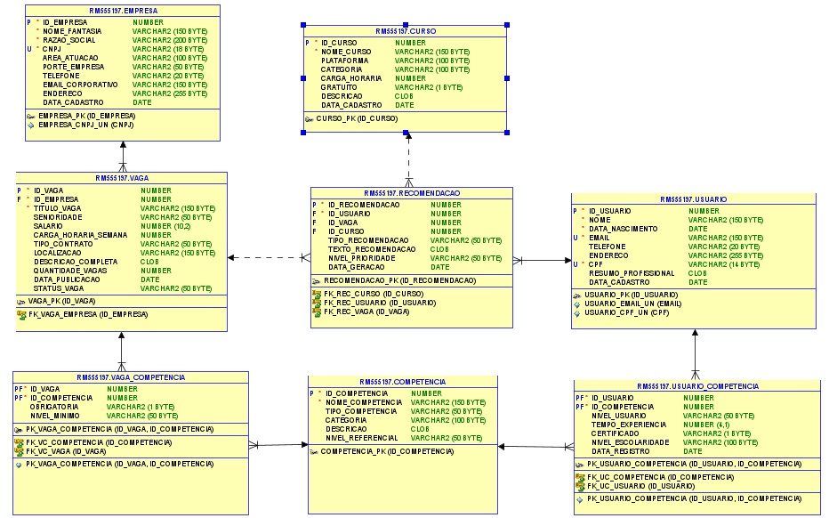

# 🚀 Next Job - Inteligência que impulsiona sua carreira


---

## 📋 Índice
- [O Problema](#-o-problema)
- [Nossa Solução](#-nossa-solução)
- [Como Rodar o Projeto](#-como-rodar-o-projeto)
- [Testando as Rotas](#-testando-as-rotas)
- [Arquitetura SQL](#-arquitetura-sql)
- [Equipe](#-equipe)

---

## 🎯 O Problema

O futuro do trabalho já começou.

Avanços tecnológicos, como a **inteligência artificial**, a **robótica** e a **automação**, estão transformando profissões, criando novas oportunidades e também desafios inéditos.

### Dados alarmantes:
- 📊 **ONU e OIT**: Até 2030, milhões de empregos poderão ser extintos
- 🔄 **Fórum Econômico Mundial**: Quase 1/4 das profissões deve mudar radicalmente até 2027
- 🎓 Necessidade de **requalificação constante** e desenvolvimento de competências humanas

Mudanças demográficas, sociais e ambientais estão redesenhando:
- Como **vivemos**
- Como **trabalhamos**
- Como nos **relacionamos**

O avanço da tecnologia coloca em xeque profissões de baixa especialização, mas também abre portas para **novas oportunidades**.

Diante dessas transformações, é essencial criar soluções que tornem o mundo do trabalho mais **inclusivo**, **justo** e **sustentável**, conectando tecnologia, inovação e propósito para transformar vidas, organizações e sociedades inteiras.

---

## 💡 Nossa Solução

### **NextJob: Assistente de Carreira Inteligente**

O NextJob é uma **plataforma inteligente** que utiliza Inteligência Artificial para ajudar candidatos a se prepararem melhor para o mercado de trabalho do futuro.

#### Como funciona:

1. 🔍 **Análise Inteligente**
   - O sistema analisa o currículo do candidato e a descrição da vaga
   - Calcula a **porcentagem de compatibilidade** entre perfil e requisitos

2. 📊 **Diagnóstico Preciso**
   - Mostra as **chances reais** de seleção
   - Indica **exatamente o que precisa ser melhorado** no currículo

3. 🎓 **Recomendações Personalizadas**
   - Sugere **cursos** e **trilhas de aprendizado** específicas
   - Ajuda a desenvolver as competências exigidas pela vaga

4. 🚀 **Crescimento Contínuo**
   - Guia o candidato **passo a passo** no crescimento profissional
   - Mostra **o que estudar**, **onde se aperfeiçoar** e **como se destacar**

### Impacto Social
O NextJob usa a tecnologia como **aliada do ser humano**, promovendo:
- ✅ Educação contínua
- ✅ Inclusão no mercado de trabalho
- ✅ Empregabilidade sustentável
- ✅ Alinhamento com os **ODS da ONU**

---

## 🛠️ Como Rodar o Projeto

### Pré-requisitos
- ☕ **Java 17+**
- 🗄️ **Oracle Database 21c** (acesso ao banco FIAP ou local)
- 🍃 **MongoDB 7.0+** (opcional - para exportação de dados)
- 🔧 **Maven 3.8+**
- 💻 **IDE** (IntelliJ IDEA, VS Code, Eclipse)

### 1️⃣ Configurar o Banco de Dados Oracle

#### Opção A: Via SQL Developer

1. **Conectar ao banco Oracle:**
   - Utilize suas credenciais institucionais da FIAP
   - Configure a conexão com os dados fornecidos pelo professor

2. **Executar o script completo:**
   - Abra o arquivo `database/Next_Job.sql`
   - Selecione todo o conteúdo (`Ctrl+A`)
   - Execute com `F5` (Run Script)
   - Aguarde a conclusão (1-2 minutos)

3. **Inicializar os dados:**
   ```sql
   BEGIN
     PKG_INICIALIZACAO.PRC_INICIALIZAR_BANCO_NEXTJOB;
   END;
   /
   ```

---

### 2️⃣ Configurar a Aplicação Spring Boot

1. **Clone o repositório:**
   ```bash
   git clone <url-do-repositorio>
   cd nextjob-springboot
   ```

2. **Configure o `application.properties`:**
   ```properties
   # Oracle Database - Configure com suas credenciais
   spring.datasource.url=jdbc:oracle:thin:@<HOST>:<PORTA>:<SID>
   spring.datasource.username=<SEU_USUARIO>
   spring.datasource.password=<SUA_SENHA>
   
   # MongoDB (opcional - para exportação)
   spring.data.mongodb.uri=mongodb://localhost:27017/nextjob
   
   # Server
   server.port=8080
   ```

3. **Instalar dependências:**
   ```bash
   mvn clean install
   ```

4. **Executar a aplicação:**
   ```bash
   mvn spring-boot:run
   ```

5. **Verificar se está rodando:**
   ```
   Acesse: http://localhost:8080
   ```

---

## 🧪 Testando as Rotas

### 🔧 Rotas de Inicialização e Gerenciamento

| Método | Endpoint | Descrição |
|--------|----------|-----------|
| `GET` | `/api/inicializar` | Insere todos os dados no banco (usuários, empresas, vagas, competências, cursos e recomendações) |
| `GET` | `/api/limpar` | Remove todos os dados mantendo a estrutura das tabelas |
| `GET` | `/api/resetar` | Limpa e reinicializa tudo do zero (limpar + inicializar) |

---

### 📊 Rotas de Consulta de Dados

| Método | Endpoint | Parâmetros | Descrição |
|--------|----------|-----------|-----------|
| `GET` | `/api/usuario/{id}/json` | `id`: ID do usuário | Retorna perfil completo do usuário em JSON |
| `GET` | `/api/compatibilidade` | `usuario`: ID do usuário<br>`vaga`: ID da vaga | Calcula compatibilidade entre usuário e vaga |


---

### 📦 Rotas de Exportação e Integração MongoDB

| Método | Endpoint | Descrição |
|--------|----------|-----------|
| `GET` | `/api/export-json` | Exporta todos os dados do Oracle para arquivos JSON locais |
| `GET` | `/api/export/mongo` | Exporta dados em formato compatível com MongoDB |
| `GET` | `/api/import-mongo` | Importa os arquivos JSON para o MongoDB |
| `GET` | `/api/processar-tudo` | Executa exportação do Oracle e importação no MongoDB |

---

### 🧪 Cenários de Teste Completo

#### Cenário 1: Primeiro Uso (Setup Inicial)
```bash
# 1. Inicializar o banco de dados
curl http://localhost:8080/api/inicializar

# 2. Verificar perfil do primeiro usuário
curl http://localhost:8080/api/usuario/1/json

# 3. Testar compatibilidade entre usuário 1 e vaga 1
curl "http://localhost:8080/api/compatibilidade?usuario=1&vaga=1"

# 4. Testar compatibilidade entre usuário 2 e vaga 5
curl "http://localhost:8080/api/compatibilidade?usuario=2&vaga=5"
```

#### Cenário 2: Resetar Sistema
```bash
# 1. Resetar banco (limpar + reinicializar)
curl http://localhost:8080/api/resetar

# 2. Verificar se dados foram reinseridos
curl http://localhost:8080/api/usuario/1/json
```

#### Cenário 3: Exportar Dados para MongoDB
```bash
# 1. Exportar do Oracle e importar para MongoDB
curl http://localhost:8080/api/processar-tudo


---

### 📋 Tabela Resumo de Todas as Rotas

| Categoria | Método | Endpoint | Função Principal |
|-----------|--------|----------|-----------------|
| **Inicialização** | GET | `/api/inicializar` | Popula o banco com dados de exemplo |
| **Inicialização** | GET | `/api/limpar` | Remove todos os dados |
| **Inicialização** | GET | `/api/resetar` | Limpa e reinicializa |
| **Consulta** | GET | `/api/usuario/{id}/json` | Perfil completo do usuário |
| **Consulta** | GET | `/api/compatibilidade` | Análise usuário x vaga |
| **Exportação** | GET | `/api/export-json` | Exporta para JSON |
| **Exportação** | GET | `/api/export/mongo` | Formato MongoDB |
| **Exportação** | GET | `/api/import-mongo` | Importa para MongoDB |
| **Exportação** | GET | `/api/processar-tudo` | Pipeline completo |

---

## 🗄️ Arquitetura SQL

### 📊 Modelo Lógico do Banco de Dados

Diagrama completo mostrando todas as tabelas, relacionamentos e chaves do sistema NextJob:



---

### Estrutura do Banco de Dados

O projeto utiliza **Oracle Database** com uma arquitetura robusta baseada em:

#### 📊 Tabelas Principais

| Tabela | Descrição | Campos Principais |
|--------|-----------|------------------|
| **USUARIO** | Dados dos candidatos | CPF (único), nome, email, telefone |
| **EMPRESA** | Empresas contratantes | CNPJ (único), razão social, setor, porte |
| **VAGA** | Oportunidades de emprego | Título, salário, regime (CLT/PJ), status |
| **COMPETENCIA** | Catálogo de habilidades | Nome, categoria (técnica/soft skill/idioma) |
| **USUARIO_COMPETENCIA** | Relacionamento N:N | Nível (1-5), anos de experiência |
| **VAGA_COMPETENCIA** | Requisitos das vagas | Nível necessário, obrigatório/desejável |
| **CURSO** | Recomendações educacionais | Nome, duração, plataforma |
| **RECOMENDACAO** | Sistema de sugestões IA | Tipo (vaga/curso), % compatibilidade |
| **AUDITORIA** | Log de operações | Operação, valores old/new, timestamp |

---

### 🔧 Triggers de Auditoria

O sistema possui **8 triggers** que registram automaticamente todas as operações DML:

| Trigger | Tabela Monitorada | Função |
|---------|-------------------|---------|
| `trg_aud_usuario` | USUARIO | Rastreia mudanças em perfis de usuários |
| `trg_aud_empresa` | EMPRESA | Monitora alterações em dados empresariais |
| `trg_aud_vaga` | VAGA | Audita criação/modificação de vagas |
| `trg_aud_curso` | CURSO | Registra mudanças no catálogo de cursos |
| `trg_aud_competencia` | COMPETENCIA | Controla alterações na base de competências |
| `trg_aud_usuario_competencia` | USUARIO_COMPETENCIA | Rastreia vinculações usuário-competência |
| `trg_aud_vaga_competencia` | VAGA_COMPETENCIA | Monitora requisitos de vagas |
| `trg_aud_recomendacao` | RECOMENDACAO | Audita recomendações geradas pela IA |

---

### 📦 Packages PL/SQL

O sistema utiliza **5 packages** para encapsular a lógica de negócio:

| Package | Responsabilidade | Principais Procedures/Functions |
|---------|------------------|--------------------------------|
| **PKG_USUARIO** | Gerenciamento de usuários | `prc_inserir_usuario`<br>`prc_atualizar_usuario`<br>`fnc_buscar_usuario` |
| **PKG_VAGA** | Operações com vagas | `prc_criar_vaga`<br>`prc_atualizar_status_vaga`<br>`fnc_listar_vagas_ativas` |
| **PKG_CONHECIMENTO** | Gestão de competências | `prc_adicionar_competencia_usuario`<br>`prc_adicionar_requisito_vaga`<br>`fnc_listar_competencias_usuario` |
| **PKG_RECOMENDACAO** | Sistema de recomendações IA | `fnc_calcular_compatibilidade`<br>`prc_gerar_recomendacoes`<br>`fnc_recomendar_cursos` |
| **PKG_INICIALIZACAO** | Inicialização do banco | `prc_inicializar_banco_nextjob`<br>`prc_limpar_dados` |


---

## 👥 Equipe

Desenvolvido para o **Global Solution 2025 - FIAP**

| Nome | RM |
|------|-----|
| Luiz Felipe | 555197 |
| Matheus Munuera | 557812 |
| Pedro Gomes | 553907 |

---

**NextJob** - Transformando futuros, uma carreira por vez. 🚀